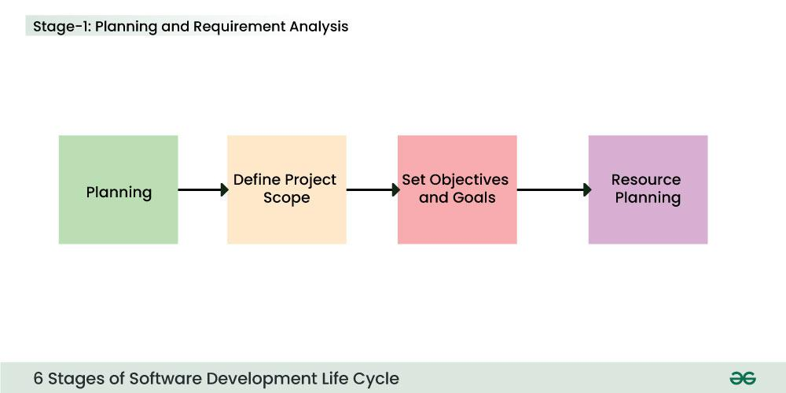
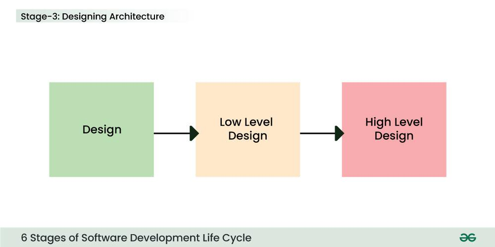
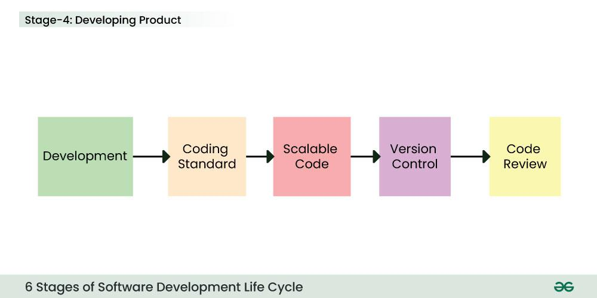
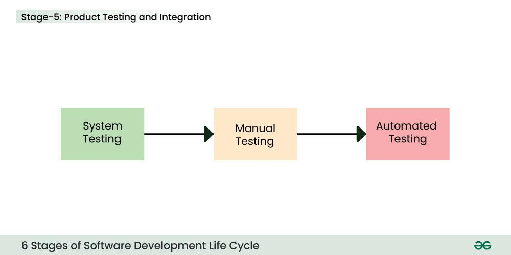

### software development life cycle
- it is a methodology that defines the entire procedure of software development step-by-step.
- is a structured process that is used to design, develop, and test good-quality software.

### stages

1. **Planning and Requirement Analysis**

2. **Defining Requirements**
This is fulfilled by utilizing [SRS](https://www.geeksforgeeks.org/software-requirement-specification-srs-format/) (Software Requirement Specification). This is a sort of document that specifies all those things that need to be defined and created during the entire project cycle. 

3. **Designing Architecture**
- with the requirements defined in SRS, multiple designs for the product architecture are present in the Design Document Specification (DDS).
- This DDS is assessed by market analysts and stakeholders. After evaluating all the possible factors, the most practical and logical design is chosen for development.

4. **Developing Product**

5. **Product Testing and Integration**

6. **Documentation, Training, and Support**
7. **Deployment and Maintenance of Products**

After detailed testing, the conclusive product is released in phases as per the organization’s strategy. Then it is tested in a real industrial environment. It is important to ensure its smooth performance. If it performs well, the organization sends out the product as a whole. After retrieving beneficial feedback, the company releases it as it is or with auxiliary improvements to make it further helpful for the customers

