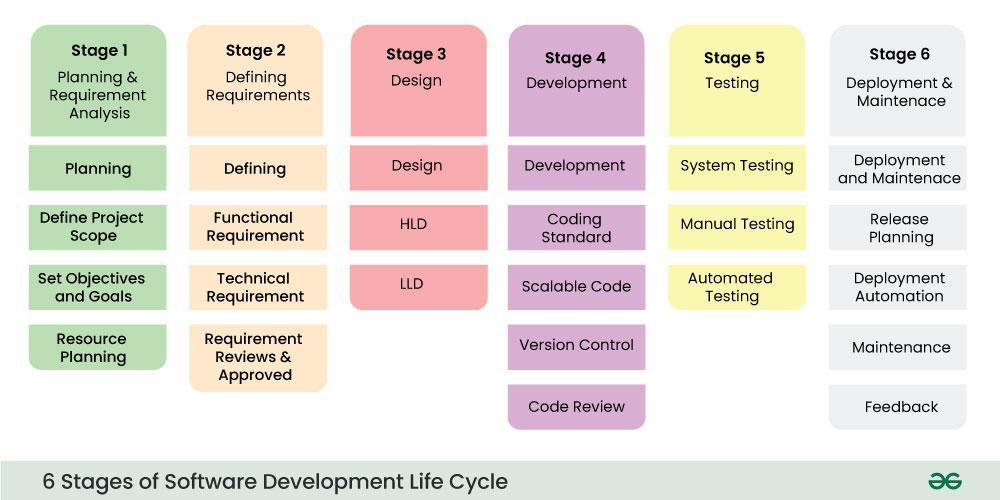

### software development life cycle
- it is a methodology that defines the entire procedure of software development step-by-step.
- is a structured process that is used to design, develop, and test good-quality software.

### stages

